This document maps the ~80 components in the NuGetGallery codebase into logical system groups,
explains how they work together, and annotates each group with a **migration disposition** for AIpkg.

> **Legend**
> - **Keep** — core concept maps directly; redesign/port to modern stack
> - **Simplify** — needed but significantly reduced in scope
> - **Evaluate** — depends on AIpkg feature decisions
> - **Drop** — NuGet-specific; no equivalent in AIpkg

---

## 1. Core Systems (Run the Service)

These are the systems that must be running 24/7 for the registry to function.

### 1.1 Web Application

The primary user-facing and API-facing surface.

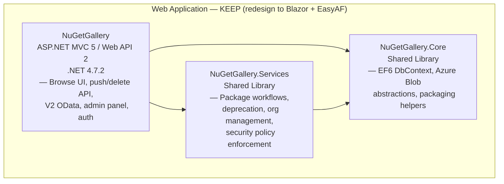

**What it does:** Serves nuget.org — lets users browse packages, upload via `dotnet nuget push`,
manage API keys and organizations, and provides the V2 OData endpoint consumed by older tooling.

**AIpkg migration:** The entire layer is replaced by Blazor SSR + Interactive Server backed by
EasyAF (SQL DB Project → EF Core 10). V2 OData surface is dropped. V3-only public API.

---

### 1.2 Search Infrastructure

Keeps package search results fast and relevant by maintaining Azure AI Search indexes.

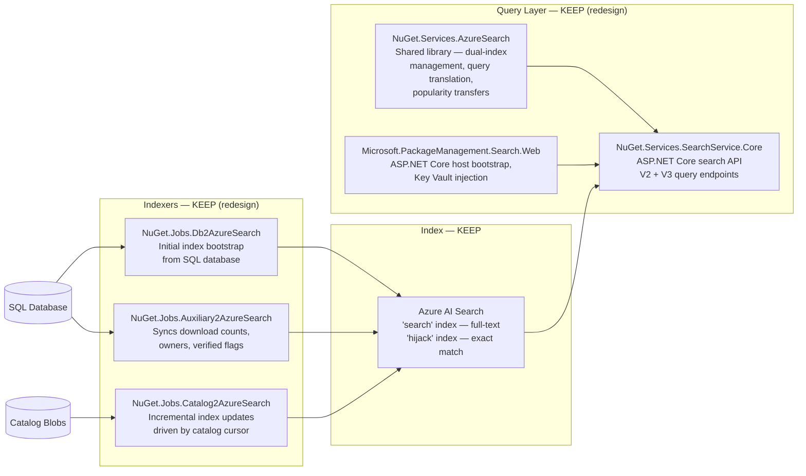

**What it does:** Two Azure Search indexes power all search — the "search" index for discovery,
the "hijack" index for exact package+version lookups. Three separate jobs keep them current:
a bootstrap job (run once), a catalog-driven incremental job, and an auxiliary job that syncs
download counts and owner metadata from SQL.

**AIpkg migration:** Keep the dual-index pattern and the three-job approach. Swap Azure AI Search
API calls for the current SDK. Drop V2 query translation; V3 only.

---

### 1.3 Catalog / V3 Metadata Pipeline

The append-only event log that makes nuget.org's metadata publicly readable and auditable.

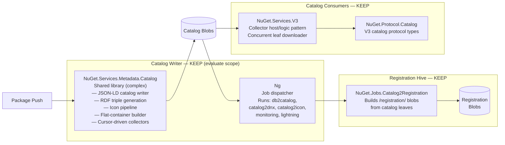

**What it does:** Every package push creates a catalog "commit" — a JSON-LD entry in an
append-only blob-based feed. Downstream jobs read this feed via cursors and materialize it into
registration blobs (one JSON file per package ID), flat-container files (used by `dotnet restore`),
and icon images. Clients can poll the catalog to mirror all of nuget.org.

**AIpkg migration:** The catalog concept (append-only event log) is valuable and maps to AIpkg's
V3 API spec. The JSON-LD/RDF machinery (dotNetRDF, json-ld.net) is the most likely candidate for
simplification or replacement. `Ng` as a monolithic job dispatcher is replaced by proper workers.

---

### 1.4 Validation Pipeline

Every package is asynchronously scanned and signed before becoming publicly available.

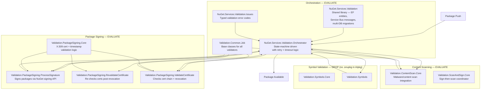

**What it does:** When a package is pushed, the Gallery creates a validation set and hands off to
the Orchestrator. The Orchestrator drives a configurable set of validators (signing check, cert
validation, content scan, symbol validation) via Service Bus messages. When all validators pass,
the package is marked available.

**AIpkg migration:** AIpkg will need some form of content validation. The orchestrator pattern is
sound. Package signing is less relevant for AI plugins; content scanning may still apply.
Symbol validation has no AIpkg equivalent. The Service Bus–driven async model is worth keeping.

---

### 1.5 Database Infrastructure

Schema management and data access across multiple SQL databases.

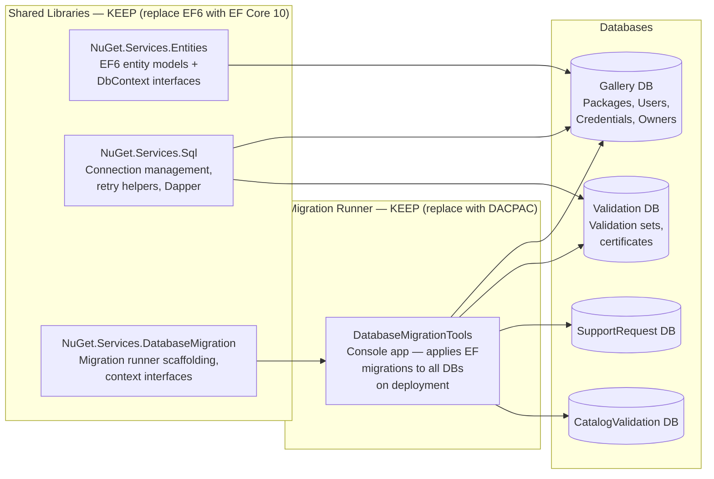

**What it does:** Four separate SQL databases are maintained with EF Code First migrations,
all applied by a single migration runner tool deployed as part of each release.

**AIpkg migration:** EasyAF replaces EF6 + migration runner with a SQL DB Project (`.sqlproj`)
as the schema source of truth, generating EF Core 10 entities. The four-database pattern
collapses — AIpkg starts with one primary database.

---

## 2. Shared Infrastructure Libraries

Cross-cutting plumbing used by virtually every component above.

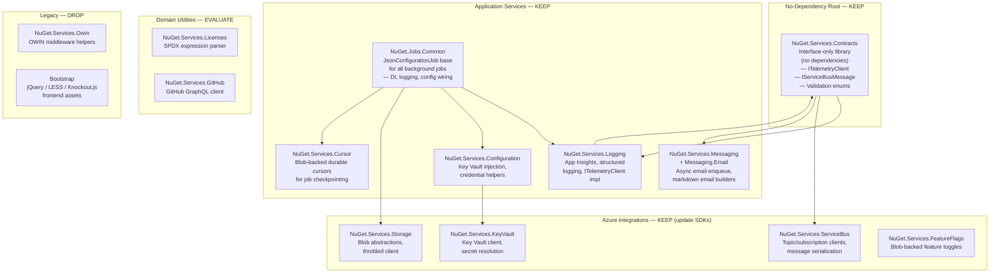

**What it does:** Every background job is built on `NuGet.Jobs.Common`'s `JsonConfigurationJob`,
which wires up dependency injection, Application Insights logging, and Key Vault config injection
consistently. Azure Service Bus handles async messaging between the Gallery and validators.
Blob-backed cursors let every long-running job resume exactly where it left off after a restart.

**AIpkg migration:** The contracts-first, no-dependency-root pattern is worth keeping. Azure SDK
wrappers need updating to current packages. OWIN and Bootstrap are dropped entirely with the move
to ASP.NET Core + Blazor.

---

## 3. Supplemental Systems (One-Off Tasks / Operations)

These systems augment operations but are not on the critical path for the registry to function.

### 3.1 Statistics Pipeline

Download count tracking from CDN log files to the Gallery database.

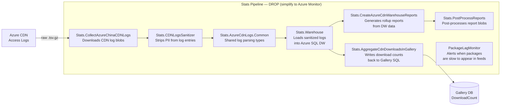

**What it does:** Six separate jobs form an ETL pipeline: collect raw CDN log files from Azure,
sanitize PII, load into a SQL Data Warehouse, generate rollup reports, post-process blobs, and
finally aggregate download counts back into the Gallery database where search indexers pick them up.

**AIpkg migration:** This entire pipeline is likely replaced by Azure Monitor / Application
Insights aggregation. Download counting is simpler at AIpkg's initial scale.

---

### 3.2 GitHub / Security Intelligence

Ingests security advisories from GitHub and surfaces them alongside affected packages.

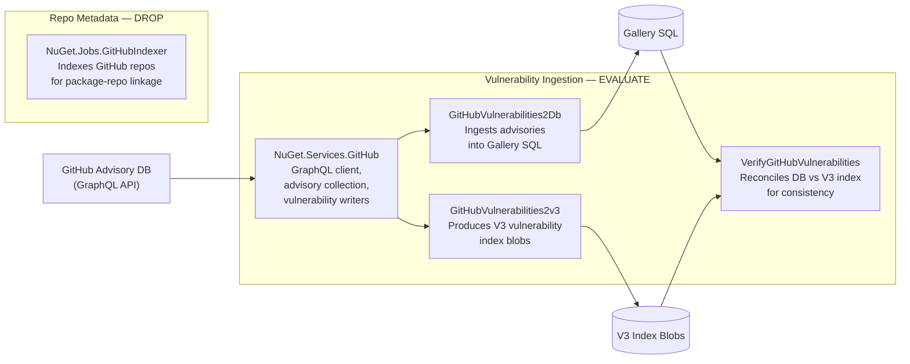

**What it does:** A GraphQL-polling job pulls new security advisories from GitHub's database,
writes them to both the Gallery SQL (for UI display) and V3 blobs (for tooling consumption).
A separate job indexes GitHub repositories to link packages to their source repos.

**AIpkg migration:** Vulnerability advisories for AI plugins is a valid future feature.
The GitHub Advisory database may not have AI plugin coverage yet. Repo indexing is likely dropped.

---

### 3.3 Operations & Admin Tools

Human-in-the-loop maintenance and monitoring tasks.

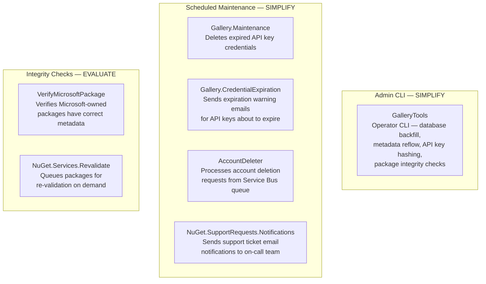

**What it does:** `GalleryTools` is the operator's Swiss Army knife — an admin CLI for backfill
operations that are run ad-hoc when schema changes need retroactive data updates. The scheduled
jobs handle routine hygiene: expired credential cleanup, expiration warnings, and account deletion
fulfillment. Integrity check jobs provide confidence that data is consistent across systems.

**AIpkg migration:** A similar admin CLI pattern will be needed. Credential expiration warnings
are directly applicable (API keys). Account deletion is required for GDPR compliance. The specific
`VerifyMicrosoftPackage` check has no AIpkg equivalent.

---

### 3.4 Blob Storage Operations

One-time and periodic blob management tasks.

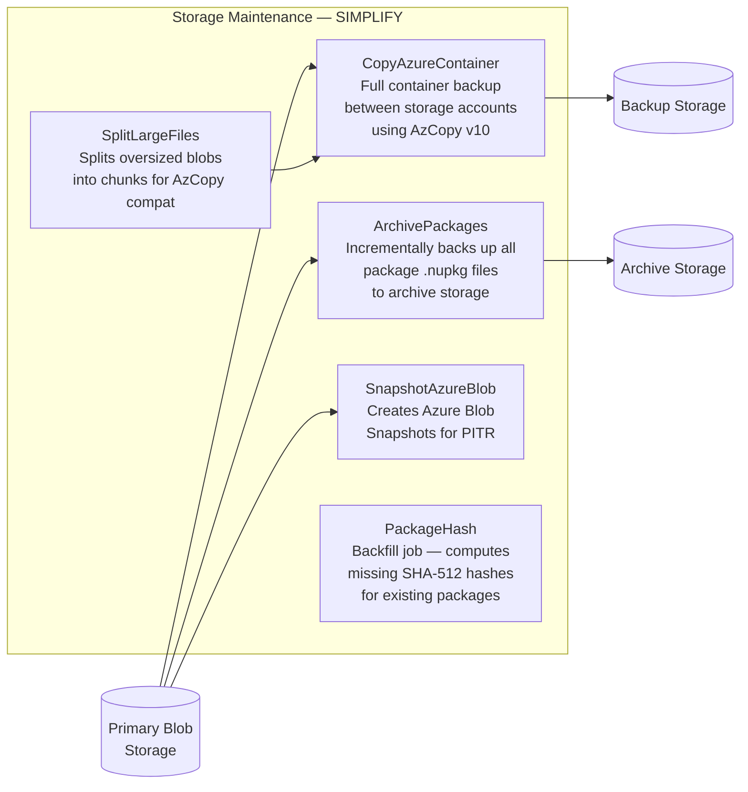

**What it does:** A family of utility jobs manage blob storage hygiene: incremental package
archival, full container backups, point-in-time recovery snapshots, and a historical backfill for
packages that were uploaded before hash computation was added.

**AIpkg migration:** Package backup and snapshotting remain applicable. `PackageHash` is a one-time
historical backfill that won't be needed for a greenfield service. `SplitLargeFiles` is likely
unnecessary at AIpkg's initial scale.

---

### 3.5 Status & Incident Monitoring

External-facing status page infrastructure.

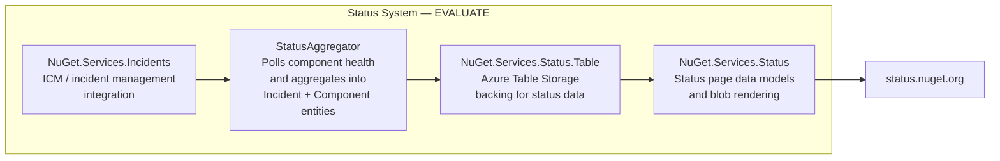

**What it does:** A background aggregator polls component health endpoints and synthesizes
the data into incident records written to Azure Table Storage, which are then rendered into
the public status page.

**AIpkg migration:** A status page is worthwhile. The aggregator pattern is sound. ICM
integration is Microsoft-internal; AIpkg would use a different incident management tool.

---

### 3.6 CDN Redirect

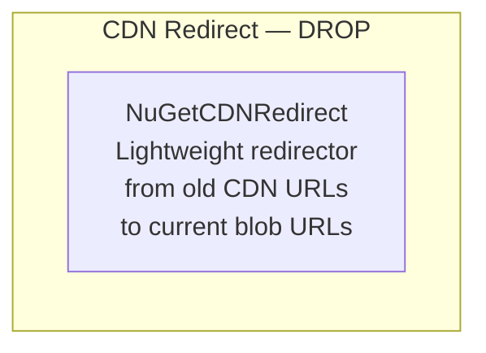

**What it does:** Redirects legacy CDN URLs to current Azure CDN / blob storage URLs for
backwards compatibility with old tooling.

**AIpkg migration:** Not applicable. AIpkg starts fresh with no legacy CDN URL debt.

---

### 3.7 Catalog Validation & Monitoring

Ensures the V3 catalog feed is consistent and complete.

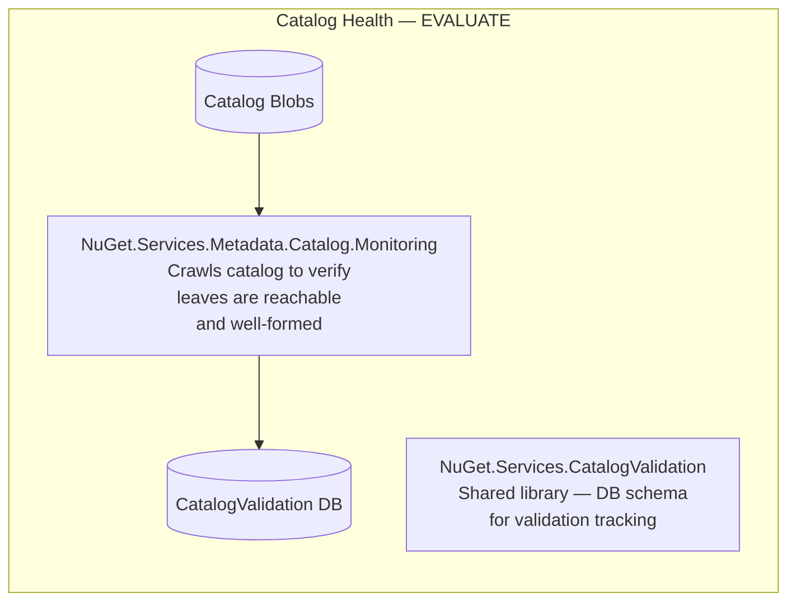

**What it does:** A monitoring job crawls the catalog feed to verify that every leaf blob is
readable and correctly formed, writing results to a dedicated validation database.

**AIpkg migration:** Catalog health monitoring is valuable if AIpkg ships a V3 catalog.
The specific implementation can be significantly simplified.

---

## 4. Migration Disposition Summary

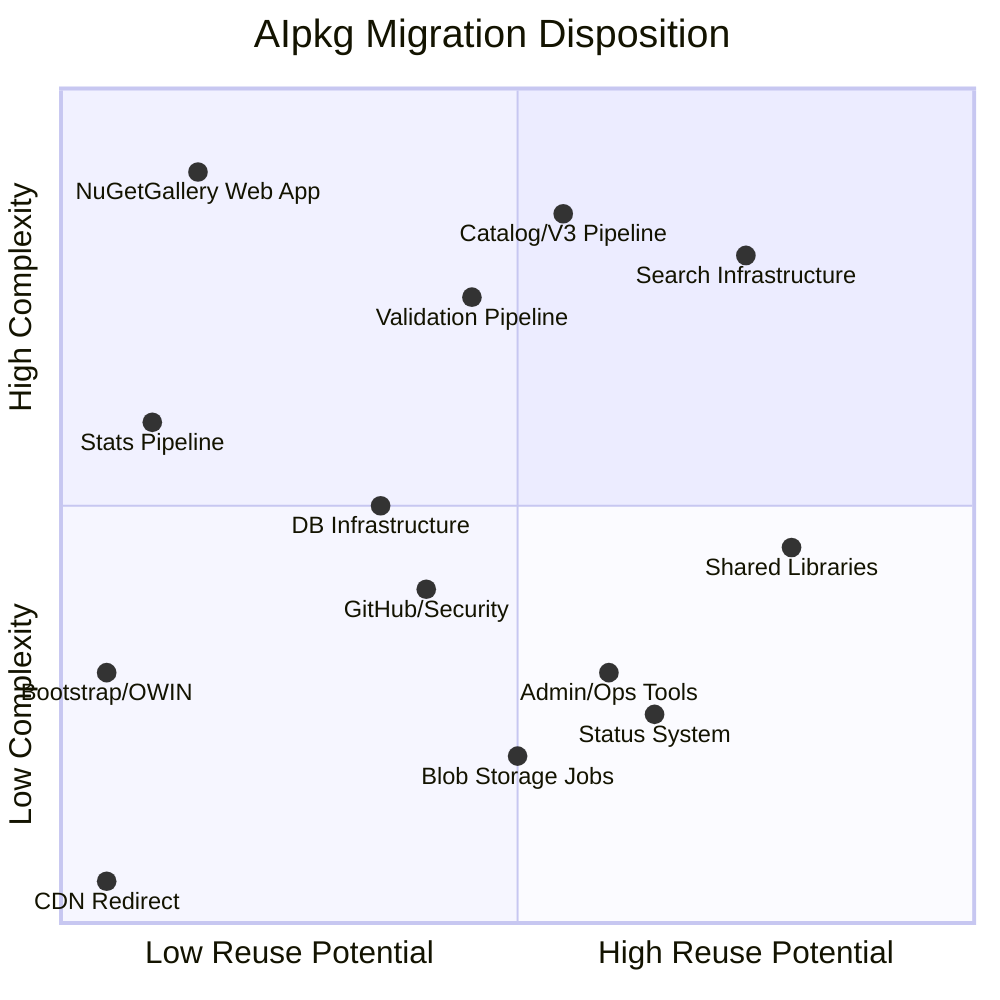

| System Group | Components | Disposition | Reason |
|---|---|---|---|
| Web Application | NuGetGallery, .Core, .Services | **Keep / Full Redesign** | Replaced by Blazor + EasyAF; V2 OData dropped |
| Search Infrastructure | 5 components | **Keep / Update** | Dual-index pattern is solid; update Azure Search SDK |
| Catalog / V3 Pipeline | 5 components | **Keep / Simplify** | Drop RDF/JSON-LD complexity; keep append-only model |
| Validation Pipeline | 10 components | **Evaluate** | Content scan yes; signing/symbols scope TBD |
| Database Infrastructure | 4 components | **Keep / Replace** | EF6 → EF Core 10 + SQL DB Project via EasyAF |
| Shared Libraries | ~15 components | **Keep / Update** | Contracts-first pattern, Azure SDK updates |
| Stats Pipeline | 7 components | **Drop** | Replace with Azure Monitor at AIpkg scale |
| GitHub / Security | 4 components | **Evaluate** | Feature decision — vulnerability data for AI plugins? |
| Admin / Ops Tools | 6 components | **Simplify** | Need a CLI and scheduled hygiene jobs, fewer one-offs |
| Blob Storage Jobs | 5 components | **Simplify** | Archival/backup yes; historical backfills no |
| Status System | 4 components | **Evaluate** | Status page is valuable; ICM integration is MS-internal |
| CDN Redirect | 1 component | **Drop** | No legacy URL debt in greenfield service |
| Bootstrap / OWIN | 2 components | **Drop** | Replaced by Blazor + ASP.NET Core |

---

*Generated from inventory files in `/src/AIPkg.Docs/inventory/` and legacy docs in `/src/AIPkg.Docs/legacy/`.*
